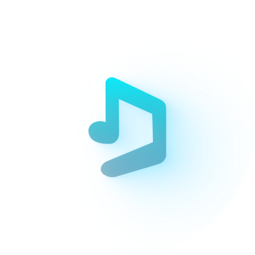

<div align="center">
  
  <br />
  <h1>AyushMuzic 🎵</h1>
  <p><strong>A Next-Generation, Ad-Free, High-Fidelity Music Streaming Client for Android & Desktop.</strong></p>
  <p>Experience the entire YouTube Music catalog wrapped in Apple Music aesthetics, audiophile-grade playback controls, on-device smart recommendations, and zero interruptions.</p>

  <p>
    <a href="https://github.com/jaatayushh/ayushmuzic"></a>
    
    
    
    
    
  </p>

  <p>
    <a href="#-key-features"><b>Features</b></a> •
    <a href="#-feature-matrix"><b>Comparison</b></a> •
    <a href="#-downloads"><b>Downloads</b></a> •
    <a href="#-windows--desktop-support"><b>Windows Support</b></a> •
    <a href="#-building-from-source"><b>Build Guide</b></a> •
    <a href="#-tech-stack"><b>Tech Stack</b></a>
  </p>
</div>

---

## ⚡ Why AyushMuzic?

Traditional streaming apps lock essential features like background playback, offline caching, and ad-free listening behind aggressive paywalls. Other third-party clients often feature clunky interfaces or fail to provide relevant music suggestions unless you log in with your Google account.

**AyushMuzic** changes the game:
1. **Apple Music Aesthetics & Liquid Glass**: Defaulted to sleek modern blurred backdrops, expressive typography, and gorgeous fluid transitions.
2. **On-Device Smart Recommendations**: Even as a guest without signing into Google, AyushMuzic analyzes your local listening history to curate tailored **"Jump back in"** and **"Similar to [Song]"** shelves.
3. **True Audiophile Power**: Seamless crossfade, 10-band EQ, headphone calibration profiles via AutoEq, and time-synced syllable-by-syllable lyrics.

---

## ✨ Key Features

### 🎨 Apple Music-Grade Aesthetics & Themes
- **Default Apple Music Experience**: Now Playing interface and time-synced lyrics view are configured to Apple Music styling out of the box.
- **Liquid Glass Real-Time Blur**: Enabled by default for a translucent, modern glassmorphism aesthetic behind album art and controls.
- **Dynamic Theming**: Choose between **Pure AMOLED Black**, Clean Light, or Android's dynamic **Material You (Monet)** theme which adapts colors based on your wallpaper.
- **Big-Card Recommendation Shelves**: Replaced small 4-row grids with large, vibrant song tiles for effortless browsing and touch targets.

### 🧠 Personalized On-Device Recommendations
- **100% Private & Account-Free**: You don't need a Google or YouTube account.
- **Local Playback Graph**: The app dynamically creates customized recommendation carousels based on your actual listening habits.
- **Instant Radio Generation**: Start an infinite radio queue from any song or artist with a single tap.

### 🎤 Word-by-Word Synced Lyrics
- **Syllable-Level Timing**: Real-time karaoke-style lyric animations synchronized down to the fraction of a second.
- **Multi-Language Translation**: Instant translations directly inside the lyrics sheet.
- **Lyrics Card Sharing**: Export and share beautifully formatted lyric snippets as images.

### 🎚️ Audiophile Acoustics & Equalizer
- **Gapless Playback & Crossfade**: Smoothly blends the end of one track into the beginning of the next (enabled by default).
- **10-Band Equalizer**: Comprehensive frequency tuning with customizable sound curves and built-in genre presets.
- **AutoEq Headphone Database**: Automatic frequency response calibration tailored specifically to your headphone model.
- **Configurable Audio Quality**: Choose from Low (66 kbps), Medium (129 kbps default), or High quality streams to balance fidelity and data usage.
- **ReplayGain & Volume Normalization**: Consistent loudness across tracks without sudden volume jumps.

### 🛡️ Clean, Ad-Free & Distraction-Free
- **Zero Ads, Zero Sponsors**: Built-in **SponsorBlock** automatically detects and skips sponsored segments, non-music intros, and outros.
- **Background Playback**: Music keeps playing when the app is minimized or when your screen is locked.
- **Return YouTube Dislike**: View authentic community like-to-dislike ratios.
- **Privacy First**: No telemetry, no user tracking, no Google account required.

### 🚗 Ecosystem & Utilities
- **Android Auto**: Full in-vehicle dashboard playback control and queue management.
- **Interactive Home Screen Widgets**: Play, pause, skip, and inspect current tracks directly from your home screen.
- **Offline Caching & Downloads**: Save tracks and full playlists directly to local storage for offline playback.
- **Sleep Timer**: Gentle fade-out timer so you can drift off to sleep without your battery draining overnight.

---

## 📊 Feature Matrix

| Feature | AyushMuzic 🎵 | YouTube Music Free | Spotify Free | Spotify Premium |
| :--- | :---: | :---: | :---: | :---: |
| **Price** | **100% Free** | Free (Ad-supported) | Free (Ad-supported) | $11.99/mo |
| **Ad-Free Playback** | ✅ **Always** | ❌ Audio & Video Ads | ❌ Audio Ads | ✅ Yes |
| **Background & Screen-Off Play** | ✅ **Yes** | ❌ Screen must stay on | ✅ Yes | ✅ Yes |
| **Guest Recommendations (No Login)** | ✅ **Yes** | ❌ Generic trending only | ❌ Account required | ❌ Account required |
| **Liquid Glass & Apple Music UI** | ✅ **Default** | ❌ No | ❌ No | ❌ No |
| **SponsorBlock (Skip Intros/Promos)** | ✅ **Built-in** | ❌ No | ❌ No | ❌ No |
| **10-Band EQ & AutoEq Profiles** | ✅ **Yes** | ❌ Basic | ❌ Basic EQ only | ❌ Basic EQ only |
| **Crossfade** | ✅ **Default** | ❌ No | ✅ Yes | ✅ Yes |
| **Word-by-Word Synced Lyrics** | ✅ **Yes** | ❌ Basic line sync | ❌ Line sync | ❌ Line sync |
| **Open Source (GPLv3)** | ✅ **100%** | ❌ Closed | ❌ Closed | ❌ Closed |

---

## 📥 Downloads

Grab the latest installers and packages:

| Platform | Target / Format | Description | Download |
| :--- | :--- | :--- | :--- |
| **Android** | `universal` (APK) | Compatible with all Android devices running Android 8.0 (API 26) or higher. | [Download APK](AyushMuzic.apk) |
| **Android** | `arm64-v8a` (APK) | Optimized, lightweight build for modern 64-bit Android smartphones. | [Download APK](AyushMuzic-arm64.apk) |
| **Windows** | `x64` (MSI Installer) | Standalone Windows 10/11 installer with bundled Java runtime and libmpv audio engine. | [Download MSI Setup](AyushMuzic-Setup.msi) |

---

## 💻 Windows & Desktop Support

AyushMuzic is architected using **Compose Multiplatform** and includes dedicated support for desktop operating systems (**Windows**, **Linux**, and **macOS**)!

The desktop target (`:desktopApp`) features:
- **Native libmpv Audio Engine**: High-performance, hardware-accelerated playback on Windows.
- **System Tray Integration**: Background playback with minimize-to-tray controls.
- **Rich Desktop Layout**: Responsive multi-column layout optimized for wide computer screens and mouse/keyboard navigation.

### Running AyushMuzic on Windows

You can run the Windows desktop application directly using Gradle:

```powershell
# Set Java 21 (e.g., from Android Studio JBR or JDK 21)
$env:JAVA_HOME = "C:\Program Files\Android\Android Studio\jbr"

# Run the Desktop app
.\gradlew.bat :desktopApp:run
```

### Packaging Windows Installers (.msi / .msix)

AyushMuzic includes built-in packaging tasks for Windows:

```powershell
# Build a standalone Windows MSI package
.\gradlew.bat :desktopApp:packageMsi

# Or create a portable UberJar executable for your current OS
.\gradlew.bat :desktopApp:packageReleaseUberJarForCurrentOS
```

Packaged installers and executables are output to:
`desktopApp/build/compose/binaries/main/`

---

## 🛠️ Tech Stack & Architecture

AyushMuzic leverages the latest modern multiplatform technologies:

```
┌────────────────────────────────────────────────────────┐
│                      AyushMuzic                        │
├──────────────────────────┬─────────────────────────────┤
│    Android (androidApp)  │    Desktop (desktopApp)     │
│    - AndroidX Media3     │    - libmpv Audio Engine    │
│    - Android Auto        │    - System Tray & Shortcuts│
│    - Jetpack Glance      │    - Window Management      │
├──────────────────────────┴─────────────────────────────┤
│               Shared UI (:composeApp)                  │
│    - Compose Multiplatform (Material 3 Expressive)     │
│    - Apple Music & Liquid Glass Shaders                │
│    - Navigation & Dynamic Theming                      │
├────────────────────────────────────────────────────────┤
│             Core Domain & Data (:core)                 │
│    - Kotlin Coroutines & StateFlow                     │
│    - Room Database (Local Caching & History)           │
│    - AndroidX DataStore (Preferences)                  │
│    - Ktor HTTP Client (YouTube Music API Scraper)      │
│    - AutoEq Database & SponsorBlock Integration        │
└────────────────────────────────────────────────────────┘
```

- **Languages**: Kotlin (100%) Multiplatform
- **UI Toolkit**: Compose Multiplatform & Jetpack Compose
- **Media Engines**: AndroidX Media3 / ExoPlayer (Android) & libmpv via JNA (Desktop)
- **Local Persistence**: Room SQLite Database & AndroidX DataStore
- **Networking**: Ktor Asynchronous HTTP Client
- **Architecture**: Clean Architecture + MVVM (Model-View-ViewModel)

---

## 🏗️ Building from Source

### Prerequisites
- **Java Development Kit**: JDK 21 or Android Studio Ladybug/Meerkat JBR
- **Android SDK**: Build Tools 35+, Compile SDK 35 (Android 15)
- **Git**

### Step-by-Step Build

1. **Clone the repository with submodules**:
   ```bash
   git clone --recursive https://github.com/jaatayushh/ayushmuzic.git
   cd ayushmuzic
   ```

2. **Initialize core submodules (if cloned without `--recursive`)**:
   ```bash
   git submodule update --init --recursive
   ```

3. **Build the Android APK**:
   ```bash
   # On Windows (PowerShell)
   $env:JAVA_HOME = "C:\Program Files\Android\Android Studio\jbr"
   .\gradlew.bat :androidApp:assembleDebug

   # On Linux/macOS
   ./gradlew :androidApp:assembleDebug
   ```
   The generated APK will be at:
   `androidApp/build/outputs/apk/debug/androidApp-universal-debug.apk`

4. **Build the Windows Desktop App**:
   ```bash
   .\gradlew.bat :desktopApp:run
   ```

---

## 🤝 Contributing

Contributions, issues, and feature requests are welcome!
Feel free to open an issue or submit a pull request on the [GitHub repository](https://github.com/jaatayushh/ayushmuzic).

---

## 📜 License

This project is licensed under the **GNU General Public License v3.0 (GPL-3.0)**. See the [LICENSE](LICENSE) file for more information.

<div align="center">
  <sub>Crafted with ❤️ by <a href="https://github.com/jaatayushh">Ayush</a> & the open-source community.</sub>
</div>
